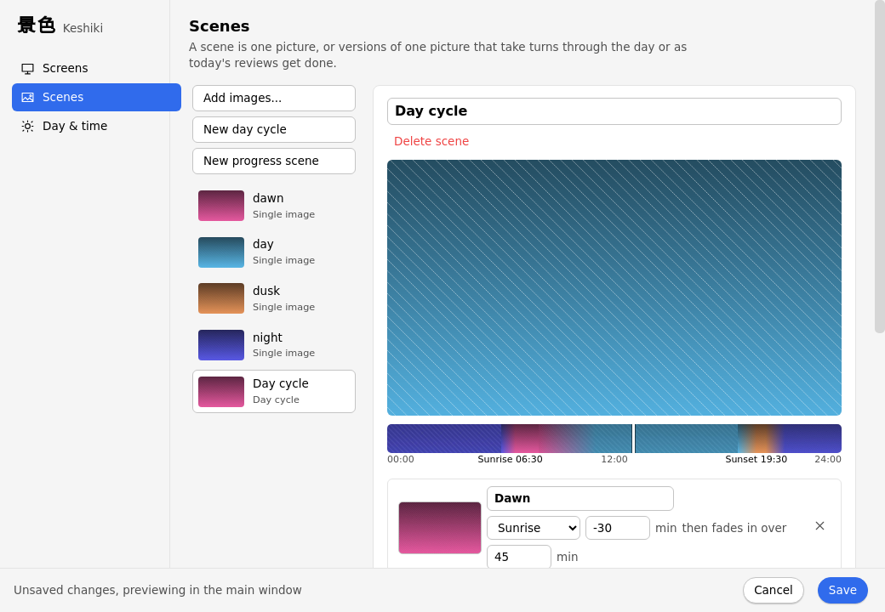

# Keshiki 景色

Background scenes for Anki's main window that follow the sun through the day, and can change once you're done studying.


- **One picture across the whole window.** The toolbar, the main area and the bottom bar show one continuous image, with no seams where they meet.
- **Day cycles.** Give a scene dawn, day, dusk and night versions. Each fades in as the sun passes a height you choose (dawn from -10° up to the horizon, say), for the real sun where you are or the sunrise and sunset times you set.
- **Light by the sun.** Optionally colour any picture by the sun's height: warm low sun, plain midday, blue twilight and a dim, faded night, based on published daylight measurements and night-vision research.
- **All done for today.** Show different scenes once nothing is left to study in any deck.
- **Shuffle.** Pick several scenes for a screen and Keshiki crossfades between them every 15 minutes up to once a day.
- **Readable.** Dim and blur are set separately for the deck list and for studying, and dimming follows Anki's light or dark theme.

## Using it

Open **Tools → Keshiki Backgrounds...**.

1. On **Screens**, choose **Add images...**. Each picture becomes a scene on the deck list.
2. On **Scenes**, choose **New day cycle**, then pick a picture for each version. Drag along the strip under the preview to see any time of day, or press ▶ to watch the next 24 hours as a timelapse. Anki's main window follows along until you press **Back to now**.
3. Back on **Screens**, give **Studying** its own scenes if you like, and set dim and blur.

Your edits show in the main window as you make them. **Save** keeps them and **Cancel** puts things back.



For day cycles that follow the real sun, choose **The sun where I am** on **Day & time**. Click **Find my location** to look up a rough location from your internet address (through ipapi.co). Nothing is sent until you click it. You can also type coordinates instead.

Images are copied into the add-on's `user_files` folder, so they stay when the add-on updates.

Keshiki needs Anki 26.08 or newer. Turn off other background add-ons (like Custom Background Image and Gear Icon) while you use it. They draw over its picture.

## Development

```sh
python -m venv .venv && . .venv/bin/activate
pip install pytest ruff "aqt[qt6]"
ruff check . && python -m pytest -q
python tools/check_main_window.py --screenshots /tmp/shots   # real Anki, offscreen
python tools/check_settings.py --screenshots /tmp/shots
python tools/build_addon.py                                   # dist/keshiki-<version>.ankiaddon
python tools/dev_sync.py --watch                              # copy into your Anki's addons21/keshiki
```

- After the first sync and a restart, a running Anki reloads Keshiki on every sync, with no restart. The synced copy has a `DEV_WATCH` file that turns this on, and is listed as "Keshiki (dev)". Changes to the root `__init__.py` still need a restart.
- To reload by hand, open Anki's debug console (Ctrl+Shift+;) and run `import keshiki; keshiki.reload_addon()`.
- Keshiki logs to Anki's `logs/addons/keshiki/` folder, which Tools → Add-ons → View Files opens one level up.
- `tools/qt_checks.sh` runs every real-Anki check, and fails on any deprecation notice Anki prints. Set `KESHIKI_STRICT_ANKI_NOTICES=1` to make `pytest` do the same; without it, notices are listed at the end of the run. On Linux they need Qt's usual system libraries.
