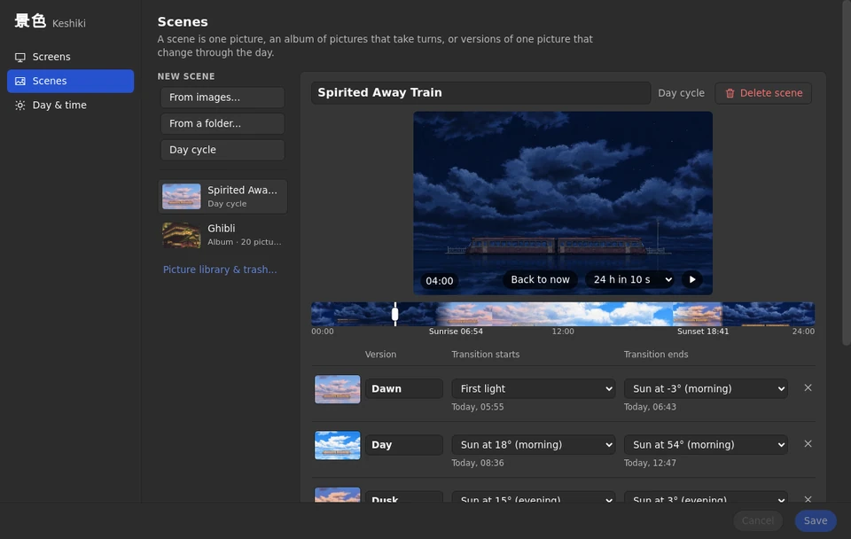
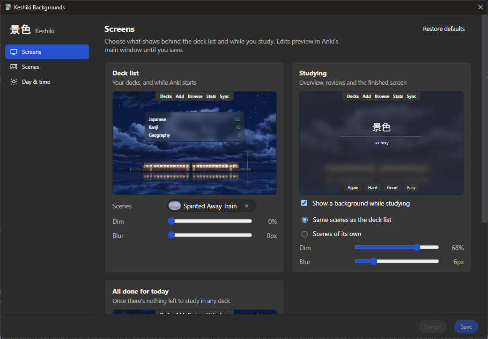

# Keshiki 景色

Background scenes for Anki's main window that follow the sun through the day, and can change once you're done studying.



- **One picture across the whole window.** The toolbar, the main area and the bottom bar show one continuous image, with no seams where they meet.
- **Day cycles.** Give a scene dawn, day, dusk and night versions. Each fades in between two moments of the sun you choose (from first light to sunrise, say), at a set time, or once the version before it is fully in, for the real sun where you are or the sunrise and sunset times you set.
- **Light by the sun.** Optionally colour any picture by the sun's height: warm low sun, plain midday, blue twilight and a dim, faded night, based on published daylight measurements and night-vision research. At night, a picture's own lights (lit windows, lamps, stars) stay lit and glow softly.
- **All done for today.** Show different scenes once nothing is left to study in any deck.
- **Albums and shuffle.** Add a batch of pictures and they become an album. On a screen, an album's pictures take turns with its other scenes: every 15 minutes up to once a day, or each time Anki starts. A screen with a single scene keeps it.
- **Readable.** Dim and blur are set separately for the deck list and for studying, and dimming follows Anki's light or dark theme.

## Using it

Open **Tools → 🖼️ Keshiki**.

1. On **Screens**, choose **Add images...**. The pictures become an album on the deck list, taking turns. Already have single-picture scenes there? **Combine** folds them into an album.
2. On **Scenes**, choose **New day cycle**, then pick a picture for each version. Drag along the strip under the preview to see any time of day, or press ▶ to watch the next 24 hours as a timelapse. Anki's main window follows along until you press **Back to now**.
3. Back on **Screens**, give **Studying** its own scenes if you like, and set dim and blur.

Your edits show in the main window as you make them. **Save** keeps them and **Cancel** puts things back.



<sub>Screenshots use stills from <i>Spirited Away</i> © Studio Ghibli.</sub>

For day cycles that follow the real sun, choose **The sun where I am** on **Day & time**. Click **Find my location** to look up a rough location from your internet address (through ipapi.co). Nothing is sent until you click it. You can also type coordinates instead.

Images are copied into the add-on's `user_files` folder, so they stay when the add-on updates.

Keshiki needs Anki 26.08 or newer. Turn off other background add-ons (like Custom Background Image and Gear Icon) while you use it. They draw over its picture.

## Development

Keshiki's plumbing (wiring with Anki, settings page shell, live reload, build
and test tooling) is [Kiso](https://github.com/mcgrizzz/Kiso), bundled into `keshiki/_kiso/` when it's
built.

```sh
python -m venv .venv && . .venv/bin/activate
pip install pytest ruff "aqt[qt]" -e ../kiso
ruff check . && python -m pytest -q      # bundles Kiso first
tools/qt_checks.sh --screenshots /tmp/shots   # real Anki, offscreen
kiso build                               # dist/keshiki-<version>.ankiaddon
kiso sync --watch                        # copy into your Anki's addons21/keshiki
```

- GitHub Actions runs the same on every push (Kiso's add-on workflows: tests on Anki 26.08 and the newest, the real-Anki checks, the build). A tag `v<version>` makes a draft release with the `.ankiaddon` and its `.sha256`.
- After the first sync and a restart, a running Anki reloads Keshiki on every sync, with no restart. The synced copy is listed as "Keshiki (dev)". Changes to the root `__init__.py` still need a restart.
- To reload by hand, open Anki's debug console (Ctrl+Shift+;) and run `import keshiki; keshiki.reload_addon()`.
- Keshiki logs to Anki's `logs/addons/keshiki/` folder, which Tools → Add-ons → View Files opens one level up.
- `tools/qt_checks.sh` fails on any deprecation notice Anki prints. Set `KISO_STRICT_ANKI_NOTICES=1` to make `pytest` do the same; without it, notices are listed at the end of the run. On Linux the real-Anki checks need Qt's usual system libraries.
